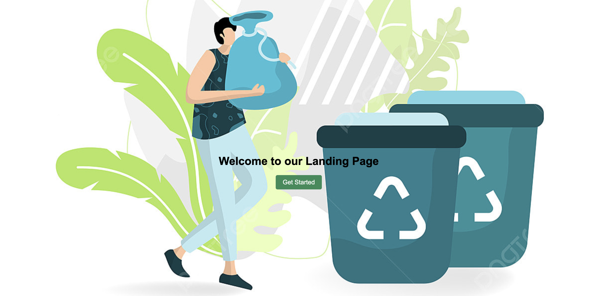
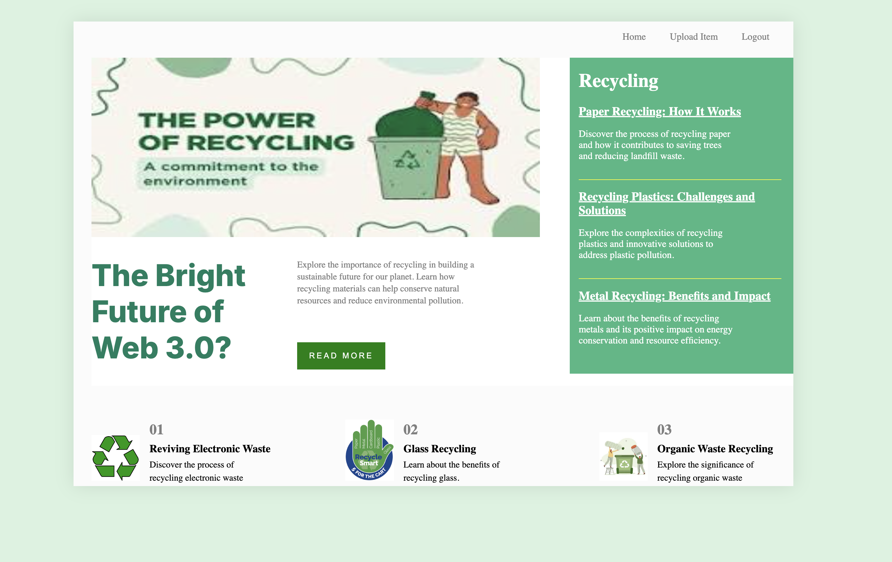
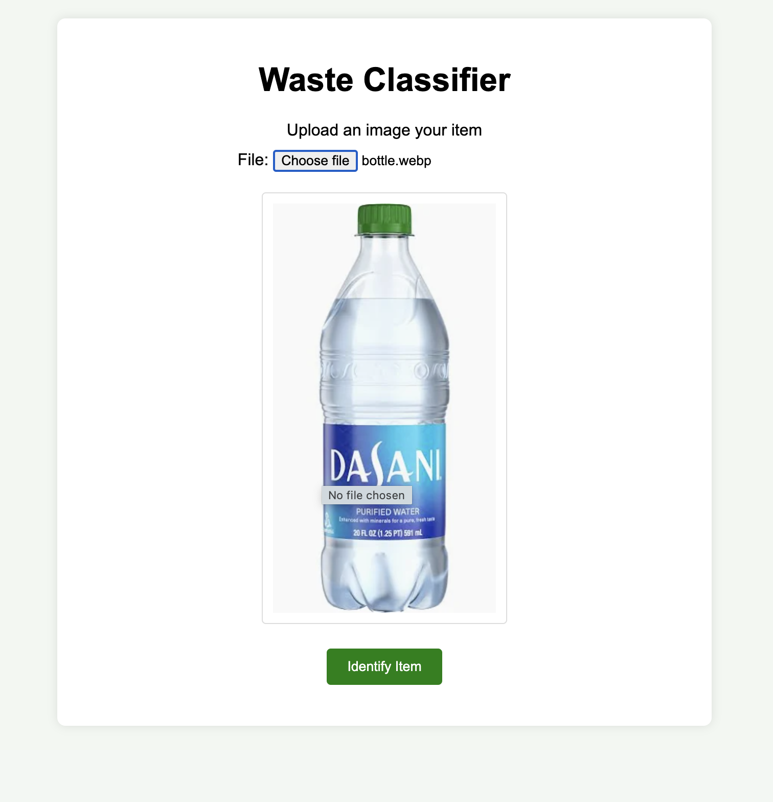
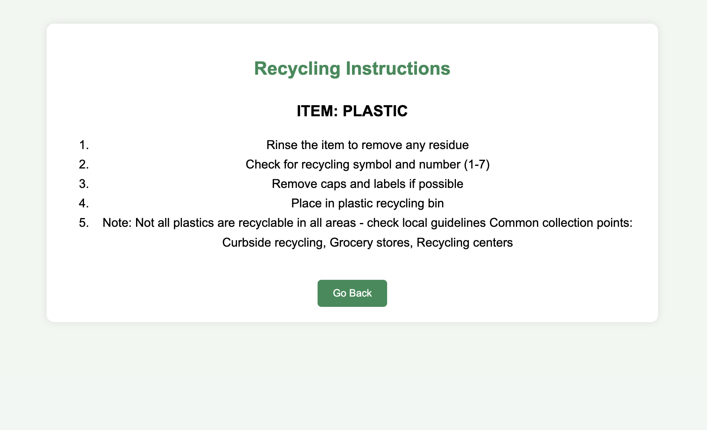
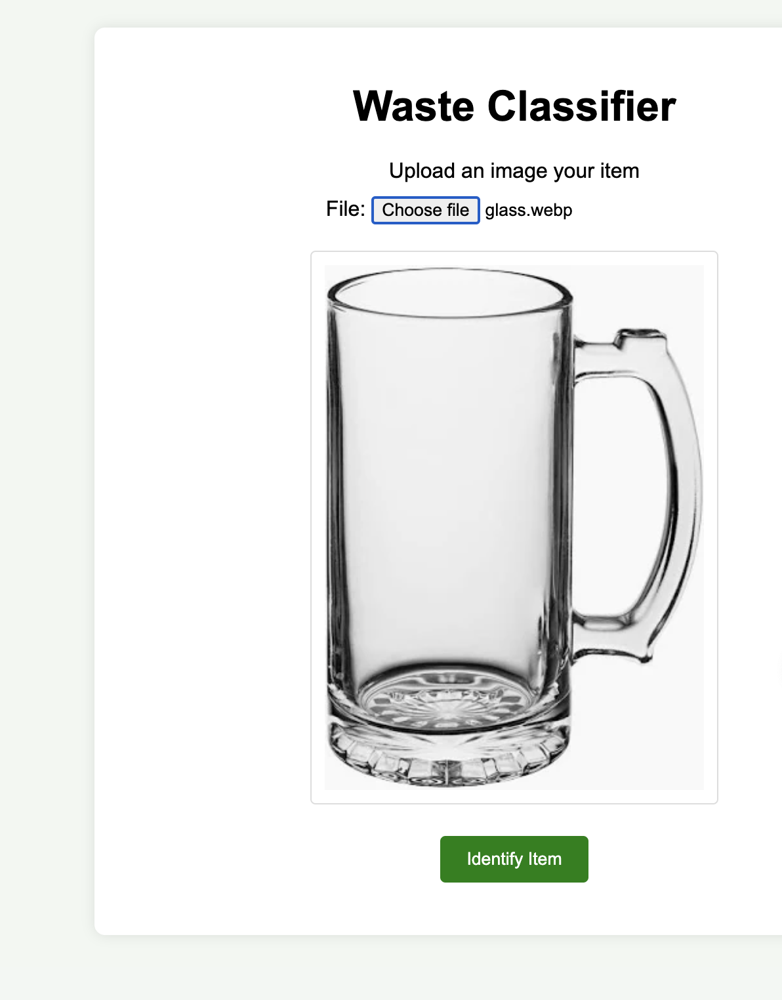
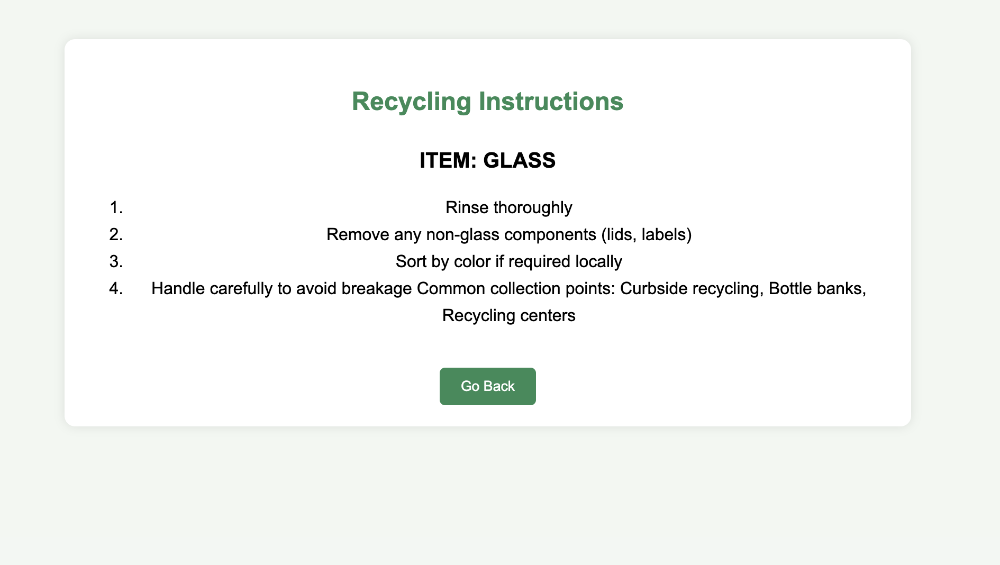

# WasteApp
# EcoSort: Smart Waste Recognition & Recycling Guide 🌱

## Overview
EcoSort is an intelligent waste management system that uses computer vision to identify materials and provide recycling instructions. By leveraging the power of ResNet50 architecture, the system helps users make informed decisions about waste disposal and promotes sustainable practices.

## 🔍 Problem Statement
- Confusion about proper waste disposal methods
- Lack of immediate access to recycling information
- Need for automated material identification
- Environmental impact of improper waste disposal

## 💻 Technology Stack
- **Deep Learning Model**: ResNet50 architecture
- **Framework**: Python (PyTorch)
- **Image Processing**: PIL (Python Imaging Library)
- **Frontend**: HTML, CSS, JavaScript
- **Material Classification Categories**:
  - Plastic
  - Glass
  - Paper
  - Metal
  - Cardboard
  - Cloth
  - Other Materials

## 🚀 Features
- **Real-time Material Recognition**: Instantly identifies the material composition of objects
- **Recycling Guidelines**: Provides detailed recycling instructions for identified materials
- **User-friendly Interface**: Simple upload-and-analyze functionality
- **Educational Component**: Helps users learn about proper recycling practices

## 📸 Screenshots

### Landing Page

*Welcome interface of EcoSort*

### Dashboard

*Main interface where users can upload images*

### Example 1: Plastic Item

*User uploading a plastic item*


*Recycling instructions for plastic items*

### Example 2: Glass Item

*User uploading a glass cup*


*Recycling instructions for glass items*

## 🔧 Installation & Setup

```bash
# Clone the repository
git clone [repository-url]

# Navigate to project directory
cd ecosort

# Create virtual environment
python -m venv venv

# Activate virtual environment
source venv/bin/activate  # For Unix
venv\Scripts\activate     # For Windows

# Install dependencies
pip install -r requirements.txt

# Run the application
python app.py
```

## 📦 Dependencies
- PyTorch
- torchvision
- PIL
- Python 3.7+
- Other requirements listed in requirements.txt

## 💡 How It Works
1. **Image Upload**: User uploads an image of the waste item
2. **Processing**: ResNet50 model processes the image
3. **Classification**: System identifies the material type
4. **Instructions**: Provides specific recycling instructions based on the material

## 🔍 Model Details
- Architecture: ResNet50
- Pre-trained on ImageNet
- Fine-tuned for material recognition
- Supports multiple material categories
- High accuracy in common household items

## 🤝 Contributing
We welcome contributions! Please follow these steps:
1. Fork the repository
2. Create a feature branch
3. Commit your changes
4. Push to the branch
5. Submit a pull request

## 📝 Future Improvements
- Mobile app development
- Additional material categories
- Location-based recycling center recommendations
- Community features for sharing recycling tips
- Integration with local waste management systems

## 👥 Contact
- Email: [onwuchulubachidubem@gmail.com]
- Website: dubemmm.pythonanywhere.com


## 🙏 Acknowledgments
- ResNet50 architecture developers
- PyTorch team
- Contributors and testers
- Environmental sustainability community
